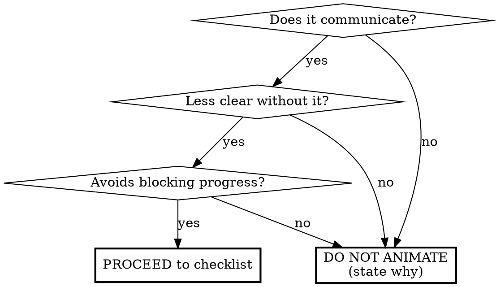

# Micro-interactions

Strict, checklist-driven rules for animation code. Rooted in Emil Kowalski's motion philosophy: restraint first, purpose always, subtlety over spectacle.

**Type:** Rigid. Follow exactly. No adaptation, no "creative interpretation."

**Builds on:** `frontend-style` skill (design tokens). This skill is the single source of truth for motion timing, easing, and animation rules. If `frontend-style` conflicts, this skill takes precedence.

**References:** `src/app/lib/motion.ts` (tokens), `src/app/hooks/useReducedMotion.ts` (accessibility hook).

## Scope

**Applies to:** Component-level Framer Motion animations and inline CSS transitions.

**Does NOT apply to:**
- CSS keyframe animations in Tailwind config (`animate-shimmer`, `animate-aurora`) — governed by `frontend-style`
- CSS `color`/`background-color` transitions on hover/focus states — those are Tailwind utility classes
- Static layout, typography, spacing

## The Purpose Gate (MANDATORY)

Before writing ANY animation code, answer these three questions. If any answer is "no", do not animate.

### Gate 1: "Does this animation communicate something?"

It must serve exactly one of:
1. **Provide feedback** — "your click worked"
2. **Show state change** — "this is now active"
3. **Reveal spatial relationships** — "this came from there"
4. **Reduce perceived wait time** — "the system is working"

### Gate 2: "Is the interface less clear without it?"

The Kowalski test: "If you can remove an animation and the interface still makes sense, remove it."

### Gate 3: "Does it avoid blocking user progress?"

Instant feedback first, then motion follows. If the user must wait, do not animate.

### Anti-patterns

- Decorative bounces/spins after clicks
- Loading indicators on instant actions
- Page transitions that delay content
- Animating everything on screen at once
- Motion that exists "because it looks nice"
- Staggering every element in a section "to look impressive"

## Implementation Checklist

Once the Purpose Gate passes, follow every item. No skipping.

### 1. Property Selection

- ONLY animate `transform` and `opacity`
- NEVER animate `width`, `height`, `top`, `left`, `margin`, `padding`, `boxShadow`, or any layout-triggering property
- Framer Motion `layout` prop is permitted (it uses FLIP transforms internally)
- Do NOT add `will-change` CSS properties. Browsers optimize `transform`/`opacity` automatically.

### 2. Token Usage — No Hardcoded Values

All timing values MUST come from `motion.ts`:

| Token | Value |
|---|---|
| `DURATION.FAST` | `0.1` (100ms) |
| `DURATION.MEDIUM` | `0.2` (200ms) |
| `DURATION.SLOW` | `0.4` (400ms) |
| `EASING.ENTER` | `[0.4, 0, 0.2, 1]` |
| `EASING.EXIT` | `[0.4, 0, 1, 1]` |
| `EASING.STANDARD` | `[0.4, 0, 0.2, 1]` |
| `STAGGER.DELAY` | `0.06` (60ms) |
| `BUTTON_PRESS_SCALE` | `0.96` |

`EASING.STANDARD` and `EASING.ENTER` currently share the same curve. The distinction is semantic: use `STANDARD` for symmetric feedback, `ENTER` for directional entrance. If values diverge later, usages will already be correct.

### 3. Duration & Easing Matching

| Interaction type | Duration | Easing (in) | Easing (out) |
|---|---|---|---|
| Small feedback (hover, press, ripple) | `DURATION.FAST` | `EASING.STANDARD` | `EASING.STANDARD` |
| UI transitions (modal, dropdown, reveal) | `DURATION.MEDIUM` | `EASING.ENTER` | `EASING.EXIT` |
| Scroll-triggered reveals (`whileInView`) | `DURATION.MEDIUM` | `EASING.ENTER` | `EASING.EXIT` |
| Large movements (page, panel) | `DURATION.SLOW` | `EASING.ENTER` | `EASING.EXIT` |

Exit animations use the same `DURATION` token as enter. Do not introduce custom durations.

### 4. Accessibility

- Import and check `useReducedMotion` in EVERY component that animates
- When reduced motion preferred: instant state changes (no duration, no transform)
- No exceptions

### 5. Hierarchy & Choreography

- Primary elements animate first, secondary follow
- Stagger delays MUST use `STAGGER.DELAY` (0.06) — not custom values
- Background/overlay animates last
- Never animate everything simultaneously

### 6. Interruptibility

- All animations must be interruptible mid-flight
- No chained sequences that block user action
- Use `AnimatePresence` for enter/exit

### 7. Consistency Check

- Match timing of similar existing animations in the codebase
- Follow established patterns (all modals fade+scale, all buttons scale down)
- If introducing a new pattern, justify why existing ones don't apply

## Post-Implementation Validation

Run through before considering work done:

1. **Reduced motion audit** — component renders correctly with `prefers-reduced-motion: reduce`. No broken layouts or missing content.
2. **Removal test** — mentally remove the animation. Interface still works? Good (animation is additive). Interface breaks? Bad (too load-bearing on motion).
3. **No hardcoded values** — grep the ENTIRE file (not just your changes) for raw numbers in `duration`, `delay`, `transition`, easing. All must trace to `motion.ts`. If existing code in the same file has hardcoded animation values, fix them too.
4. **Property check** — only `transform` and `opacity` animated. No `boxShadow`, `height`, `width`.
5. **Interruptibility** — what if user triggers reverse action mid-animation? Must cleanly cancel.
6. **Frequency check** — will this play hundreds of times per session? Must be extremely subtle or removed.

## Philosophical Anchors

Tie-breakers for ambiguous decisions:

> "If you can remove an animation and the interface still makes sense, remove it."

> "Great motion feels invisible. You don't notice it, you just understand what happened."

> "Interfaces feel broken not when they crash, but when they fail to respond."

> "If everything moves, nothing stands out."

> "Subtle ≠ boring." Understatement feels premium.

> "Motion is the soul of interface design — subtle enough not to be noticed, powerful enough to be felt." — Emil Kowalski

## Red Flags — STOP

If you catch yourself thinking any of these, you are rationalizing:

| Rationalization | Reality |
|---|---|
| "This needs a custom duration because..." | Use `DURATION` tokens. The system is designed for these exact cases. |
| "A custom cubic-bezier gives it more personality" | Use `EASING` tokens. Consistency > personality. |
| "0.18s reads better than 0.1s for this lift" | `DURATION.FAST` or `DURATION.MEDIUM`. Pick one. No in-between. |
| "The exit should be shorter for responsiveness" | Same `DURATION` token as enter. Always. |
| "Custom stagger delays for synchronized landing" | `STAGGER.DELAY` (0.06). Always. |
| "boxShadow animation adds depth" | Forbidden. Use opacity on a shadow element if needed. |
| "will-change improves performance" | Forbidden. Browser handles `transform`/`opacity` compositing. |
| "Every element should animate in for impact" | If everything moves, nothing stands out. Animate less. |
| "It looks more impressive with longer durations" | Shorter is better. Users equate speed with polish. |
| "The existing code's hardcoded values are out of scope" | If you touch a file, fix all animation token violations in it. No exceptions. |

## Output Behavior

When following this skill, do NOT narrate every checklist item. Work through the gates and checklist silently. Only surface:
- If you chose NOT to animate (with the Purpose Gate reason)
- If a checklist item forced a design change (briefly explain what and why)
